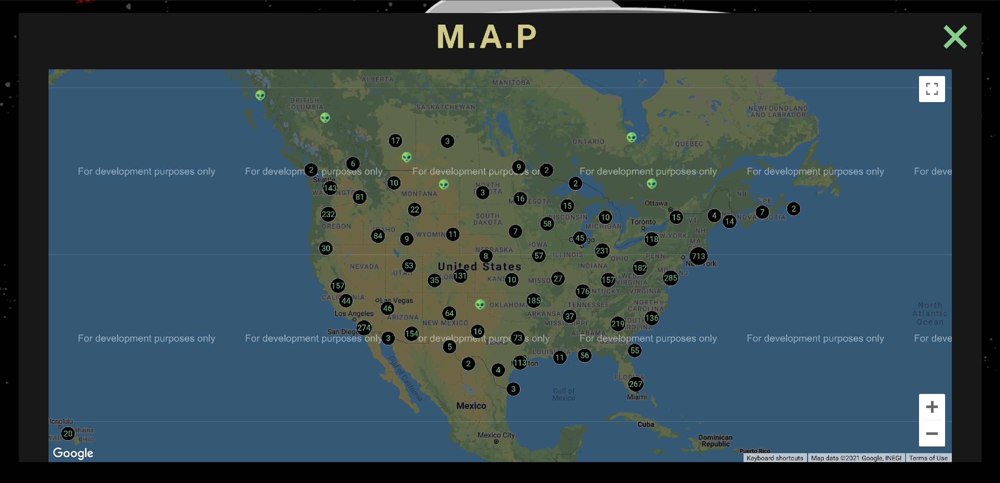
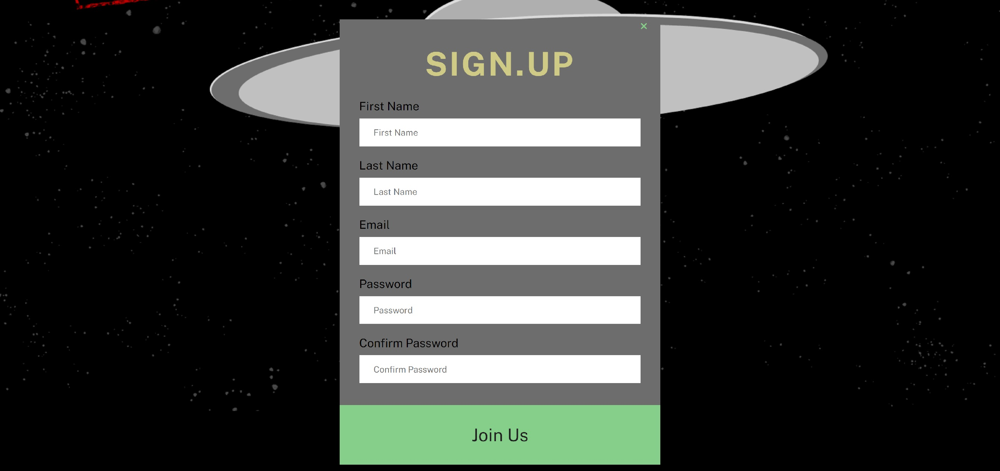
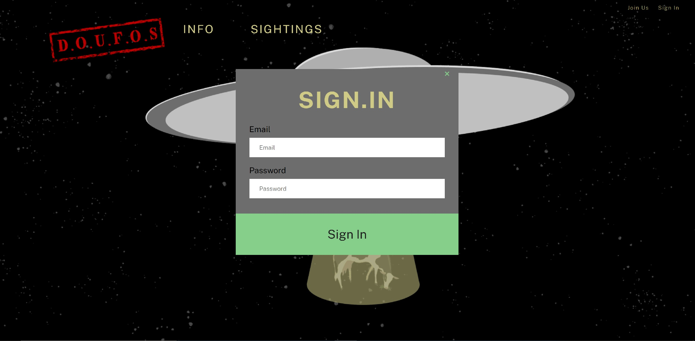

# Project-3: DOUFUS

## Description

The main objective in this project was to build an application with MERN, Feact, Express, MySQL, MongoDB and GraphQL.

This project, DOUFUS, is an database site that features an interactive map that document UFO sightings. Users can view all sightings reported on the map, as well as sign up to join and report their own sightings.

## link to deployed application

[repository](https://github.com/Limnation/project3)

[app heroku](https://doufos.herokuapp.com/)

## Visuals

## Installation

List of Dependencies:

- bcrypt - The bcrypt library on NPM makes it really easy to hash and compare passwords in Node

- dotenv - Dotenv is a zero-dependency module that loads environment variables from a . env file into process

- express - a minimal and flexible Node.js web application framework that provides a robust set of features to develop web and mobile applications

- mysql2 - MySQL client for Node.js with focus on performance. Supports prepared statements, non-utf8 encodings, binary log protocol, compression, ssl much more

- sequelize - Sequelize is a promise-based Node. js ORM tool for Postgres, MySQL, MariaDB, SQLite and Microsoft SQL Server. It features solid transaction support, relations, eager and lazy loading, read replication and more

- slug - Changes selected string to make them ready to be used in a URL by modifying, then updating it to lowercase by default, and inserting - instead of spaces

## Grading Requirements for Project #2

-Use React for the front end.

Use GraphQL with a Node.js and Express.js server.

Use MongoDB and the Mongoose ODM for the database.

Use queries and mutations for retrieving, adding, updating, and deleting data.

Be deployed using Heroku (with data).

Have a polished UI.

Be responsive.

Be interactive (i.e., accept and respond to user input).

Include authentication (JWT).

Protect sensitive API key information on the server.

Have a clean repository that meets quality coding standards (file structure, naming conventions, best practices for class and id naming conventions, indentation, high-quality comments, etc.).

Have a high-quality README (with unique name, description, technologies used, screenshot, and link to deployed application).

## Authors and acknowledgment

- Scott Erwin | email: scottallenerwin@gmail.com - Javascript, Models, Routes, Seeds, Database, HTML, CSS, Software Deployment, Design and Assets Creation
- Richard Crippen | email: richardcrippen@gmail.com - Javascript, Models, Routes, Seeds, Database, Design Feedback, and Code Reviews
- Zachary Eggert | email: zreggert@gmail.com - Javascript, Routes and Models
- Winsor Sineus | email: sineusw@gmail.com - JavaScript, Routes, Form Management
- Sarah Martin | email: sv7337@outlook.com - Agile Roadmap and Asset Management
